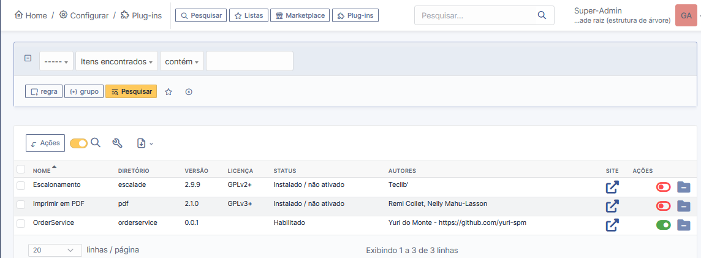
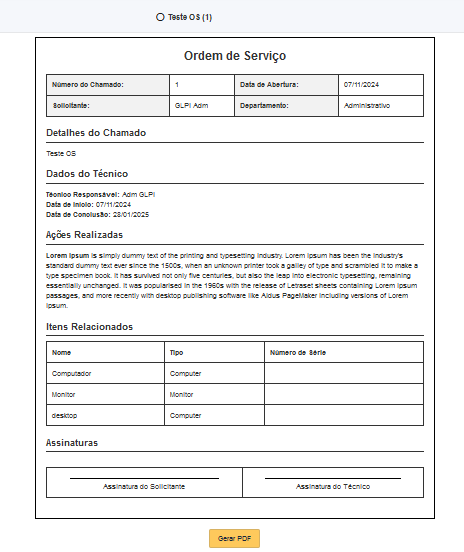
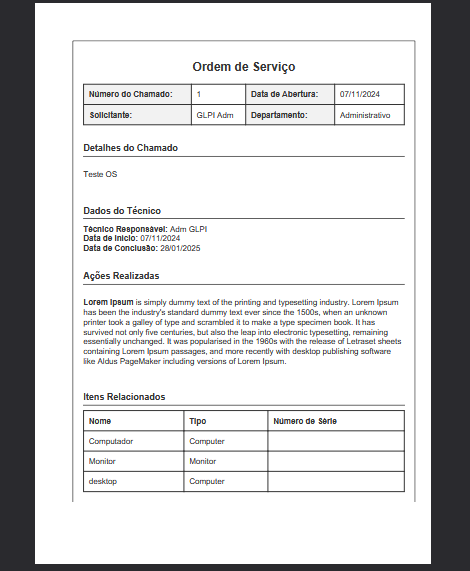

# OrderService GLPI plugin 🚀

Plugin para geração de Ordem de Serviço

## ➡️ Funcionalidades do Código

1. **Busca automática: Recupera todos os itens vinculados a um chamado.** 
2. **Geração de PDF: Cria um documento formatado com as informações da Ordem de Serviço.** 

## ➡️ Instalação 

1. **Copie a pasta do plugin para o diretório ../glpi/plugins/..**
2. **Acesse o GLPI via interface web.**
3. **Vá até Configuração → Plugins e instale/ative o plugin.**

📌 Requisitos

1. **GLPI versão 10 ou superior.**
2. **PHP versão 8.0 ou superior.**

🛠️ Como Usar

**Acesse um chamado no GLPI.**
**Utilize a opção disponibilizada pelo plugin para gerar a Ordem de Serviço.**
**Baixe o PDF gerado com os detalhes do chamado.**

